# 🛡️ AirMalSys – Air-Gapped Malware Analysis

<div align="center">

[](https://github.com)
[](https://python.org)
[](https://ubuntu.com)

**Air-Gapped Malware Analysis System**  
*Safe • Isolated • Automated*

</div>

---

## 👨‍💻 **Creators**

<table>
<tr>
<td align="center" width="33%">
<a href="https://github.com/Trimulia02">

<br />
<sub><b>Tri Mulia Bahar</b></sub>
</a>
<br />
<sub>github.com/Trimulia02</sub>
</td>
<td align="center" width="33%">
<a href="https://github.com/atanasiusps">

<br />
<sub><b>Atanasius Pradiptha Sampurno</b></sub>
</a>
<br />
<sub>github.com/atanasiusps</sub>
</td>
<td align="center" width="33%">
<a href="https://github.com/Kinnaruo">

<br />
<sub><b>Kinanti Aria Widaswara</b></sub>
</a>
<br />
<sub>github.com/Kinnaruo</sub>
</td>
</tr>
</table>

---

## 📋 Overview

This project integrates **Cuckoo Sandbox 3** into an **air-gapped malware analysis system** running on a **mini-PC**.

It allows safe dynamic analysis of malware inside isolated Windows VMs without internet access, eliminating cloud costs and minimizing security risks.

> **📚 Academic Project Notice**  
> This project was built for a college final project task. For that reason, all development has been stopped, as the creators have already graduated.

---

## ✨ Features

<div align="center">

| 🔐 **Security** | 🤖 **Automation** | 💻 **Interface** | 📊 **Reporting** | ✅ **Quality** |
|:---:|:---:|:---:|:---:|:---:|
| Air-Gapped Security | Automated Initialization | Web-Based File Upload | Automated Reporting | White-Box Tested |
| No internet connection | Shell scripts configure | Simple interface for | Generates detailed | Verified main logic |
| preventing malware leaks | networking, cleanup, | submitting samples | `report.json` and | paths for stability |
| | and sandbox startup | without CLI | optional PDF summaries | |

</div>

### 🔹 **Key Capabilities:**
- **Air-Gapped Security** – No internet connection, preventing malware leaks
- **Automated Initialization** – Shell scripts configure networking, cleanup, and sandbox startup  
- **Windows VM Analysis** – Powered by QEMU + VMCloak
- **Web-Based File Upload** – Simple interface for submitting samples without CLI
- **Automated Reporting** – Generates detailed `report.json` and optional PDF summaries
- **White-Box Tested** – Verified main logic paths for stability

---

## 🛠️ Requirements

<table>
<tr>
<td width="50%">

### 📋 **System Requirements**
- **OS**: Ubuntu 22.04
- **Python**: 3.10  
- **Linux User**: Must have a user named `cuckoo`

</td>
<td width="50%">

### 📦 **Dependencies**
- **Tools**: QEMU, VMCloak, YARA, uWSGI, Nginx
- **All official Cuckoo3 dependencies**
- **Reference**: [Cuckoo3 official documentation](https://github.com/cert-ee/cuckoo3)

</td>
</tr>
</table>

---

## 🚀 Installation and Usage

### 1️⃣ **Follow the official Cuckoo3 installation guide**
- 📖 [Cuckoo3 Documentation](https://github.com/cert-ee/cuckoo3)
- ✅ Ensure all dependencies are installed

### 2️⃣ **System Usage**
As per last development, **this system can only be used via terminal.**

```bash
# Terminal-based operation only
# Follow Cuckoo3 standard commands for analysis
```

---

## 🏗️ System Architecture

```mermaid
graph TB
    A[🖥️ Mini-PC] --> B[🐧 Ubuntu 22.04]
    B --> C[🔧 Cuckoo Sandbox 3]
    C --> D[🌐 Web Upload Interface]
    C --> E[🖥️ Windows VMs - QEMU + VMCloak]
    E --> F[📄 report.json]
    E --> G[📑 PDF Reports]
    
    style A fill:#e1f5fe
    style C fill:#f3e5f5
    style D fill:#e8f5e8
    style E fill:#fff3e0
    style F fill:#fce4ec
    style G fill:#fce4ec
```



---

## ⚠️ Project Status

<div align="center">

**🎓 ARCHIVED PROJECT 🎓**

This project is **no longer in active development** as it was completed for academic purposes.  
All creators have graduated and development has ceased.

</div>

---

## 📚 Documentation

For detailed setup and configuration, please refer to:
- 🔗 [Cuckoo3 Official Documentation](https://github.com/cert-ee/cuckoo3)
- 📋 System requirements listed above
- 🛠️ Dependencies installation guide

---

<div align="center">

**Built for cybersecurity research and education**

*Made with ❤️ by the AirMalSys team*

</div>
