# 🛡️ AirMalSys – Air-Gapped Malware Analysis

<div align="center">

[](https://github.com)
[](https://python.org)
[](https://ubuntu.com)
[](https://pytorch.org)

**Machine Learning-Based Malware Analysis System in Air-Gap Environment Using Mini-PC**  
*Safe • Isolated • Automated • Intelligent*

</div>

---

<div align="center">

👨‍💻 Creators
<table>
<tbody>
<tr>
<td align="center" width="33%">
<a href="https://github.com/Trimulia02">

<br />
<sub><b>Tri Mulia Bahar</b></sub>
</a>
<br />
<sub>1103210103</sub>
</td>
<td align="center" width="33%">
<a href="https://github.com/atanasiusps">

<br />
<sub><b>Atanasius Pradiptha S.</b></sub>
</a>
<br />
<sub>1103213036</sub>
</td>
<td align="center" width="33%">
<a href="https://github.com/Kinnaruo">

<br />
<sub><b>Kinanti Aria Widaswara</b></sub>
</a>
<br />
<sub>1103213165</sub>
</td>
</tr>
</tbody>
</table>

<p>
<strong>Program Studi S1 Teknik Komputer</strong>


Fakultas Teknik Elektro - Universitas Telkom


Bandung, 2025
</p>

</div>

---

## 📋 Overview

AirMalSys is an innovative **machine learning-based malware analysis system** developed as a Capstone Design project at Telkom University. This project integrates **Cuckoo Sandbox 3** with advanced **Bidirectional LSTM (BiLSTM)** algorithms to create a comprehensive malware detection solution running entirely in an **air-gapped environment** on a mini-PC.

The system provides safe dynamic and static analysis of malware samples through isolated Windows VMs without internet connectivity, eliminating cloud infrastructure costs while maintaining maximum security. By combining traditional sandbox analysis with cutting-edge machine learning techniques, AirMalSys achieves **91% accuracy** in binary classification and **66% accuracy** in malware family classification.

> **🎓 Academic Achievement**  
> This project was successfully completed as a Capstone Design thesis at **Universitas Telkom**, Faculty of Electrical Engineering, Computer Engineering Program, in **July 2025** under the supervision of **Dr. Yudha Purwanto, S.T., M.T.** and **Muhammad Faris Ruriawan, S.T., M.T.**

---

## ⚡ **Key Achievements & Performance Metrics**

### 🎯 **Machine Learning Performance**
- **Binary Classification**: 91% accuracy (Malware vs Benign detection)
- **Multiclass Classification**: 66% accuracy (9 malware families)
- **Model Architecture**: Bidirectional LSTM with PyTorch
- **Dataset**: 2,478 samples from BODMAS and DikeDataset repositories

### 🏆 **Technical Specifications**
- **Precision**: 90-92% for malware detection
- **Recall**: 90-92% for malware detection  
- **F1-Score**: 91% overall performance
- **Analysis Speed**: 2-3 minutes per sample
- **Hardware**: Intel NUC8i3BEH mini-PC
- **Environment**: Ubuntu 22.04 LTS

### 🔬 **Testing & Validation**
- **Alpha Testing**: 100% functionality validation
- **Beta Testing**: Validated by 30+ computer engineering students
- **User Acceptance**: 96.7% satisfaction rate
- **Reliability Score**: 83.99% (Cronbach's Alpha)

## ✨ Features

### 🔐 **Security & Isolation**
- **Complete Air-Gap Protection** – Zero internet connectivity during analysis
- **VM-based Isolation** – QEMU virtualization with Windows 10 target environment  
- **Safe Malware Execution** – Controlled sandbox environment prevents system infection
- **Local Processing** – All analysis performed on-device without external dependencies

### 🤖 **Advanced Machine Learning**
- **Bidirectional LSTM** – Captures sequential patterns in malware behavior
- **Dual Classification** – Binary (malware/benign) + Family classification (9 types)
- **Feature Engineering** – Process execution, DNS queries, network activity analysis
- **Real-time Inference** – Automated ML prediction integrated with sandbox results

### 🖥️ **Desktop Application & Interface**
- **PyQt5 GUI** – Native desktop application with intuitive drag-and-drop interface
- **Real-time Progress** – Live analysis status updates and progress indicators
- **Automated Setup** – One-click initialization and configuration management
- **Cross-platform Compatibility** – Optimized for Ubuntu 22.04 LTS environment

### 📊 **Comprehensive Reporting**
- **PDF Generation** – Detailed analysis reports with ReportLab integration
- **CVSS Scoring** – Industry-standard severity assessment
- **Multi-format Output** – JSON data + human-readable PDF reports
- **Glossary Integration** – Technical term explanations for accessibility

### 🎯 **Intelligent Analysis**
- **Dynamic Analysis** – Behavioral monitoring through Cuckoo Sandbox 3
- **Static Analysis** – File structure and metadata examination
- **Signature Detection** – YARA rules for pattern matching
- **Process Monitoring** – Execution path and system call analysis

---

## 🛠️ Technical Architecture

### 💻 **Hardware Requirements**
- **Mini-PC**: Intel NUC8i3BEH (or equivalent)
- **RAM**: 8GB+ recommended for VM operations
- **Storage**: 512GB SSD (ADATA SU650) for optimal performance
- **Display**: Monitor with HDMI support
- **Input**: Standard USB keyboard and mouse

### 🏗️ **Software Stack**
- **OS**: Ubuntu 22.04 LTS Desktop
- **Sandbox**: Cuckoo Sandbox 3 with QEMU virtualization
- **ML Framework**: PyTorch with BiLSTM implementation
- **GUI Framework**: PyQt5 for desktop interface
- **Reporting**: ReportLab for PDF generation
- **Web Services**: uWSGI + Nginx for local web interface

### 🧠 **Machine Learning Pipeline**
- **Model Architecture**: Bidirectional LSTM (BiLSTM)
- **Input Processing**: Sequential feature extraction from sandbox reports
- **Binary Classification**: Malware vs Benign (91% accuracy)
- **Multiclass Classification**: 9 malware families (66% accuracy)
- **Feature Engineering**: Process execution, DNS queries, network activity

---

## 🚀 Installation and Setup

### 1️⃣ **Prerequisites**
- Ubuntu 22.04 LTS Desktop installed on mini-PC
- User account named `cuckoo` with sudo privileges  
- System must be disconnected from internet (air-gap requirement)
- Minimum 8GB RAM and 100GB+ available storage

### 2️⃣ **Core Dependencies Installation**
```bash
# Install essential packages
sudo apt update && sudo apt install -y python3.10 python3.10-venv python3.10-dev
sudo apt install -y qemu-kvm qemu-utils curl git build-essential

# Install additional tools
sudo apt install -y tcpdump genisoimage libffi-dev libssl-dev
sudo apt install -y uwsgi nginx libhyperscan-dev
```

### 3️⃣ **Cuckoo Sandbox 3 Setup**
```bash
# Clone and install Cuckoo3
git clone https://github.com/cert-ee/cuckoo3
cd cuckoo3
python3.10 -m venv venv
source venv/bin/activate
pip install -r requirements.txt
```

### 4️⃣ **Virtual Machine Configuration**  
```bash
# Install VMCloak for automated VM creation
pip install vmcloak
vmcloak init --win10 --iso path/to/windows10.iso
```

### 5️⃣ **Machine Learning Dependencies**
```bash
# Install PyTorch and ML libraries
pip install torch torchvision numpy pandas scikit-learn
pip install matplotlib seaborn
```

### 6️⃣ **Desktop Application Setup**
```bash
# Install PyQt5 and reporting libraries
pip install PyQt5 reportlab cvsslib
# Copy application files to appropriate directory
# Run setup scripts for automation
```

---

## 💻 Usage Guide

### 🖱️ **Desktop Application**
1. **Launch Application**: Click the AirMalSys desktop icon
2. **Wait for Setup**: System automatically configures sandbox environment  
3. **Upload Sample**: Drag-and-drop or browse to select malware sample
4. **Monitor Analysis**: Real-time progress updates during processing
5. **Review Results**: Comprehensive analysis report with severity scores
6. **Export Report**: Detailed PDF report with technical findings

### 📊 **Sample Analysis Output**
```
Analysis Results:
├── Classification: Malware (91% confidence)
├── Family: Trojan.AgentTesla
├── CVSS Score: 7.8 (High severity)
├── Signatures: 15 detected patterns
├── Behavior: Process injection, keylogging
└── Report: Detailed PDF with recommendations
```

### 🌐 **Web Interface Access** (Optional Technical View)
```
# Access Cuckoo3 web interface
http://127.0.0.1:8000

# Features available:
- Analysis task monitoring
- Detailed behavioral reports  
- VM screenshot captures
- Network traffic analysis
```

---

## 🏗️ System Architecture

```mermaid
graph TB
    A[🖥️ Mini-PC Host] --> B[🐧 Ubuntu 22.04]
    B --> C[🛡️ PyQt5 Desktop App]
    B --> D[📦 Cuckoo3 Sandbox]
    D --> E[💻 QEMU Windows 10 VM]
    D --> F[📄 Analysis Report JSON]
    F --> G[🧠 BiLSTM ML Model]
    G --> H[📊 Classification Results]
    H --> I[📑 PDF Report Generation]
    
    style A fill:#e1f5fe
    style C fill:#e8f5e8
    style D fill:#f3e5f5
    style E fill:#fff3e0
    style G fill:#fce4ec
    style I fill:#f1f8e9
```



---

## 🎯 Performance Analysis

### 📈 **Binary Classification Metrics**
| Metric | Malware Detection | Benign Detection |
|--------|-------------------|------------------|
| Precision | 92% | 90% |
| Recall | 92% | 90% |  
| F1-Score | 91% | 91% |

### 🎲 **Multiclass Classification Results**
| Malware Family | Precision | Recall | F1-Score |
|----------------|-----------|--------|----------|
| RAT | 92% | 92% | 92% |
| Keylogger | 77% | 81% | 79% |
| Botnet | 67% | 78% | 72% |
| Dropper | 88% | 58% | 70% |
| Crypto | 77% | 53% | 63% |
| Ransomware | 69% | 59% | 59% |
| Adware | 44% | 75% | 56% |
| Trojan | 48% | 53% | 53% |
| Other | 52% | 51% | 51% |

---

## 🧪 Testing & Validation

### ✅ **Alpha Testing Results**
- **White-box Testing**: 100% code coverage validation
- **Functionality Testing**: All 7 core features passed
- **ML Model Testing**: Comprehensive accuracy analysis performed
- **Security Testing**: Air-gap isolation verified

### 👥 **Beta Testing Results**  
- **Test Subjects**: 30 Computer Engineering students
- **User Satisfaction**: 96.7% overall satisfaction rate
- **Usability Score**: 90%+ ease-of-use rating
- **Interface Clarity**: 93.3% found interface intuitive
- **Report Comprehension**: 96.7% understood analysis results

### 📊 **Reliability Metrics**
- **Cronbach's Alpha**: 0.8399 (High reliability)
- **Test-Retest Consistency**: 91% reproducible results  
- **Cross-validation Accuracy**: 89% average across folds

---

## 📚 Academic Context & Research Impact

### 🎓 **Thesis Information**
- **Title**: "Sistem Analisis Malware Berbasis Machine Learning pada Lingkungan Airgap Menggunakan Mini-PC"
- **English Title**: "Machine Learning-Based Malware Analysis System in Air-Gap Environment Using Mini-PC"
- **Institution**: Universitas Telkom, Faculty of Electrical Engineering
- **Program**: S1 Computer Engineering (Teknik Komputer)
- **Completion**: July 17, 2025
- **Document Type**: Capstone Design (Tugas Akhir)

### 👨‍🏫 **Academic Supervision**
- **Supervisor I**: Dr. Yudha Purwanto, S.T., M.T. (NIP: 02770066)
- **Supervisor II**: Muhammad Faris Ruriawan, S.T., M.T. (NIP: 20920031)

### 🤝 **Industry Collaboration**
- **Partner**: Direktorat Pusat Teknologi Informasi (PuTI) - Telkom University
- **Laboratory**: Seculab (Security Laboratory) - Telkom University  


### 📊 **Research Contributions**
1. **Cost Reduction**: Eliminated cloud service dependency (saved ~$7,000/year AWS costs)
2. **Security Enhancement**: Full air-gap implementation for sensitive environments
3. **ML Innovation**: BiLSTM implementation for malware behavior analysis
4. **Practical Solution**: Desktop application for non-technical users

### 🔬 **Scientific Validation**
- **Dataset**: 2,478 samples from BODMAS and DikeDataset repositories
- **Validation**: 30-participant user acceptance testing
- **Metrics**: Standard ML evaluation (precision, recall, F1-score)
- **Reproducibility**: Complete implementation documentation provided

---

## 🌟 Key Differentiators

### 💡 **Innovation Highlights**
- **First air-gapped BiLSTM malware analysis system** documented in academic literature
- **Cost-effective alternative** to expensive cloud-based solutions
- **User-friendly desktop interface** for cybersecurity professionals
- **Real-time ML inference** integrated with dynamic sandbox analysis

### 🆚 **Comparison with Previous Research**
| Aspect | Previous Studies | AirMalSys |
|--------|------------------|-----------|
| Environment | Cloud-dependent | Air-gapped |
| ML Algorithm | K-NN, Decision Tree, Random Forest | Bidirectional LSTM |
| Dataset Size | 189-382 samples | 2,478 samples |
| Interface | Command-line only | Desktop GUI + CLI |
| Cost | $7,000+/year | One-time hardware cost |
| Accuracy | 95-97% (potentially overfitted) | 91% (validated on larger dataset) |

---

## ⚠️ Limitations & Future Work

### 🚧 **Current Limitations**
- **Terminal-based operation**: Primary interface requires Linux command-line knowledge
- **Dataset dependency**: Model performance limited by training data diversity  
- **Hardware requirements**: Specific mini-PC configuration needed
- **Manual updates**: Security signatures require manual updating in air-gap environment

### 🔮 **Suggested Improvements**
1. **Enhanced API call extraction** from Cuckoo3 for better feature engineering
2. **Automatic report cleanup** functionality for storage management
3. **Expanded malware family support** beyond current 9 categories
4. **Web-based interface** alternative to desktop application

---

## 💬 Troubleshooting & Support

### 🆘 **Common Issues**
| Problem | Solution |
|---------|----------|
| Application won't start | Ensure login as `cuckoo` user, check file permissions |
| File upload fails | Verify file format and size limits |
| Analysis gets stuck | Check VM resources and restart sandbox |
| PDF report not generating | Verify ReportLab installation and file permissions |

### 📞 **Contact Information**
For technical inquiries or collaboration opportunities related to this academic project, please contact:
- **Primary Contact**: Tri Mulia Bahar - [GitHub](https://github.com/Trimulia02)
- **Academic Institution**: Universitas Telkom - Computer Engineering Program
- **Research Lab**: Seculab - Security Laboratory

---

## 📄 License & Citation

### 📜 **License**
This project is released under the MIT License for academic and research purposes.

### 📖 **Citation**
If you use this work in your research, please cite:
```
Bahar, T.M., Sampurno, A.P., Widaswara, K.A. (2025). 
"Machine Learning-Based Malware Analysis System in Air-Gap Environment Using Mini-PC". 
Capstone Design Thesis, Computer Engineering Program, 
Faculty of Electrical Engineering, Universitas Telkom.
```

---

<div align="center">

**🎓 Academic Research Project - Universitas Telkom 2025**

[](https://telkomuniversity.ac.id)
[](https://github.com)

*Developed with dedication to advancing cybersecurity research and education*

</div>
